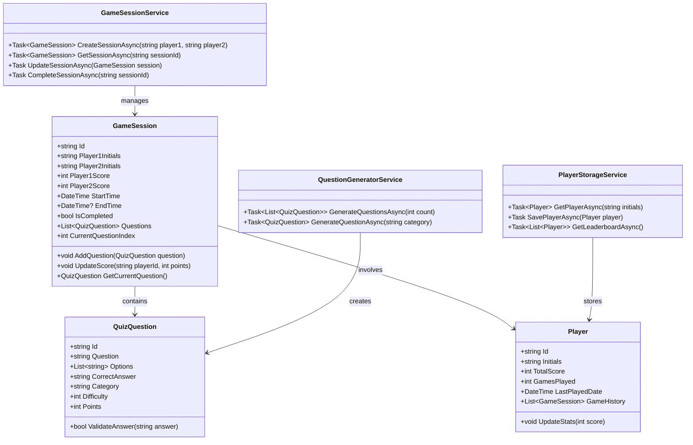

```mermaid
classDiagram
    class GameSession {
        +string Id
        +string Player1Initials
        +string Player2Initials
        +int Player1Score
        +int Player2Score
        +DateTime StartTime
        +DateTime? EndTime
        +bool IsCompleted
        +List~QuizQuestion~ Questions
        +int CurrentQuestionIndex
        +void AddQuestion(QuizQuestion question)
        +void UpdateScore(string playerId, int points)
        +QuizQuestion GetCurrentQuestion()
    }

    class Player {
        +string Id
        +string Initials
        +int TotalScore
        +int GamesPlayed
        +DateTime LastPlayedDate
        +List~GameSession~ GameHistory
        +void UpdateStats(int score)
    }

    class QuizQuestion {
        +string Id
        +string Question
        +List~string~ Options
        +string CorrectAnswer
        +string Category
        +int Difficulty
        +int Points
        +bool ValidateAnswer(string answer)
    }

    class GameSessionService {
        +Task~GameSession~ CreateSessionAsync(string player1, string player2)
        +Task~GameSession~ GetSessionAsync(string sessionId)
        +Task UpdateSessionAsync(GameSession session)
        +Task CompleteSessionAsync(string sessionId)
    }

    class QuestionGeneratorService {
        +Task~List~QuizQuestion~~ GenerateQuestionsAsync(int count)
        +Task~QuizQuestion~ GenerateQuestionAsync(string category)
    }

    class PlayerStorageService {
        +Task~Player~ GetPlayerAsync(string initials)
        +Task SavePlayerAsync(Player player)
        +Task~List~Player~~ GetLeaderboardAsync()
    }

    GameSession --> QuizQuestion : contains
    GameSession --> Player : involves
    GameSessionService --> GameSession : manages
    QuestionGeneratorService --> QuizQuestion : creates
    PlayerStorageService --> Player : stores
```
