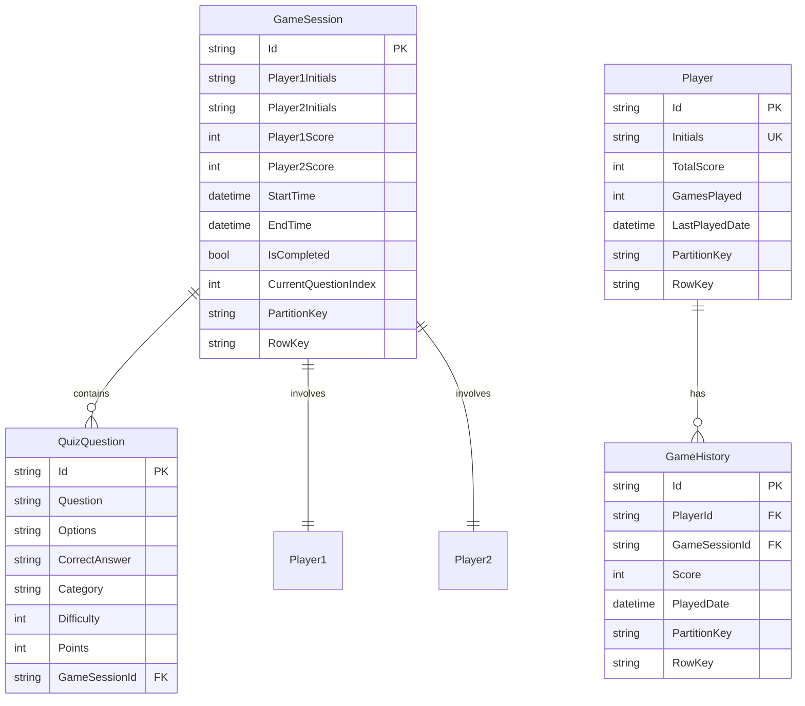

```mermaid
erDiagram
    GameSession ||--o{ QuizQuestion : contains
    GameSession ||--|| Player1 : involves
    GameSession ||--|| Player2 : involves
    Player ||--o{ GameHistory : has
    
    GameSession {
        string Id PK
        string Player1Initials
        string Player2Initials
        int Player1Score
        int Player2Score
        datetime StartTime
        datetime EndTime
        bool IsCompleted
        int CurrentQuestionIndex
        string PartitionKey
        string RowKey
    }
    
    Player {
        string Id PK
        string Initials UK
        int TotalScore
        int GamesPlayed
        datetime LastPlayedDate
        string PartitionKey
        string RowKey
    }
    
    QuizQuestion {
        string Id PK
        string Question
        string Options
        string CorrectAnswer
        string Category
        int Difficulty
        int Points
        string GameSessionId FK
    }
    
    GameHistory {
        string Id PK
        string PlayerId FK
        string GameSessionId FK
        int Score
        datetime PlayedDate
        string PartitionKey
        string RowKey
    }
```
