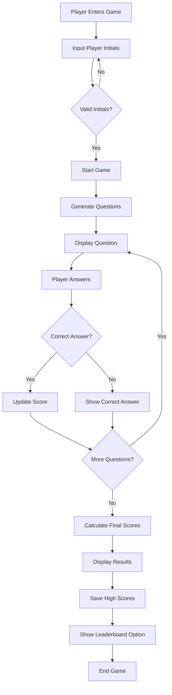

```mermaid
flowchart TD
    A[Player Enters Game] --> B[Input Player Initials]
    B --> C{Valid Initials?}
    C -->|No| B
    C -->|Yes| D[Start Game]
    D --> E[Generate Questions]
    E --> F[Display Question]
    F --> G[Player Answers]
    G --> H{Correct Answer?}
    H -->|Yes| I[Update Score]
    H -->|No| J[Show Correct Answer]
    I --> K{More Questions?}
    J --> K
    K -->|Yes| F
    K -->|No| L[Calculate Final Scores]
    L --> M[Display Results]
    M --> N[Save High Scores]
    N --> O[Show Leaderboard Option]
    O --> P[End Game]
```
