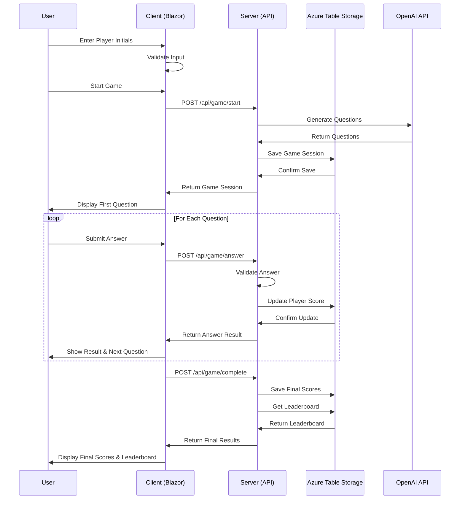

```mermaid
sequenceDiagram
    participant U as User
    participant C as Client (Blazor)
    participant S as Server (API)
    participant DB as Azure Table Storage
    participant AI as OpenAI API

    U->>C: Enter Player Initials
    C->>C: Validate Input
    U->>C: Start Game
    C->>S: POST /api/game/start
    S->>AI: Generate Questions
    AI->>S: Return Questions
    S->>DB: Save Game Session
    DB->>S: Confirm Save
    S->>C: Return Game Session
    C->>U: Display First Question
    
    loop For Each Question
        U->>C: Submit Answer
        C->>S: POST /api/game/answer
        S->>S: Validate Answer
        S->>DB: Update Player Score
        DB->>S: Confirm Update
        S->>C: Return Answer Result
        C->>U: Show Result & Next Question
    end
    
    C->>S: POST /api/game/complete
    S->>DB: Save Final Scores
    S->>DB: Get Leaderboard
    DB->>S: Return Leaderboard
    S->>C: Return Final Results
    C->>U: Display Final Scores & Leaderboard
```
