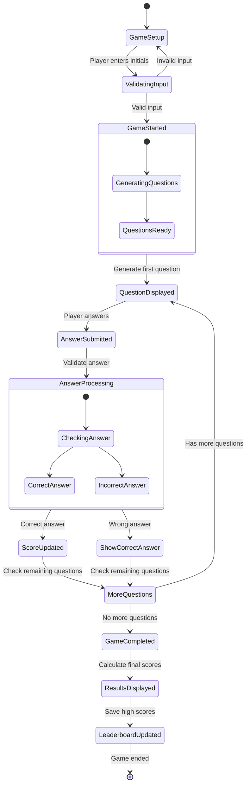

```mermaid
stateDiagram-v2
    [*] --> GameSetup
    GameSetup --> ValidatingInput : Player enters initials
    ValidatingInput --> GameSetup : Invalid input
    ValidatingInput --> GameStarted : Valid input
    
    GameStarted --> QuestionDisplayed : Generate first question
    QuestionDisplayed --> AnswerSubmitted : Player answers
    AnswerSubmitted --> AnswerProcessing : Validate answer
    
    AnswerProcessing --> ScoreUpdated : Correct answer
    AnswerProcessing --> ShowCorrectAnswer : Wrong answer
    
    ScoreUpdated --> MoreQuestions : Check remaining questions
    ShowCorrectAnswer --> MoreQuestions : Check remaining questions
    
    MoreQuestions --> QuestionDisplayed : Has more questions
    MoreQuestions --> GameCompleted : No more questions
    
    GameCompleted --> ResultsDisplayed : Calculate final scores
    ResultsDisplayed --> LeaderboardUpdated : Save high scores
    LeaderboardUpdated --> [*] : Game ended
    
    state GameStarted {
        [*] --> GeneratingQuestions
        GeneratingQuestions --> QuestionsReady
    }
    
    state AnswerProcessing {
        [*] --> CheckingAnswer
        CheckingAnswer --> CorrectAnswer
        CheckingAnswer --> IncorrectAnswer
    }
```
