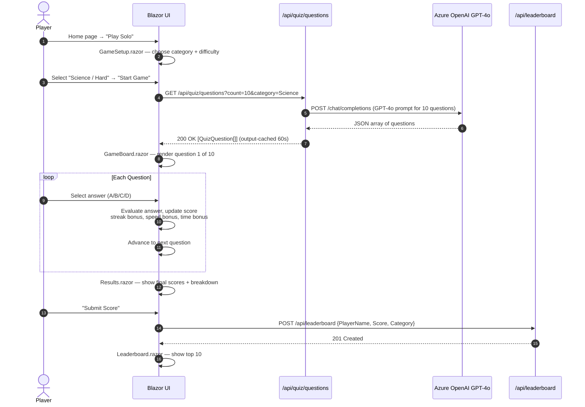
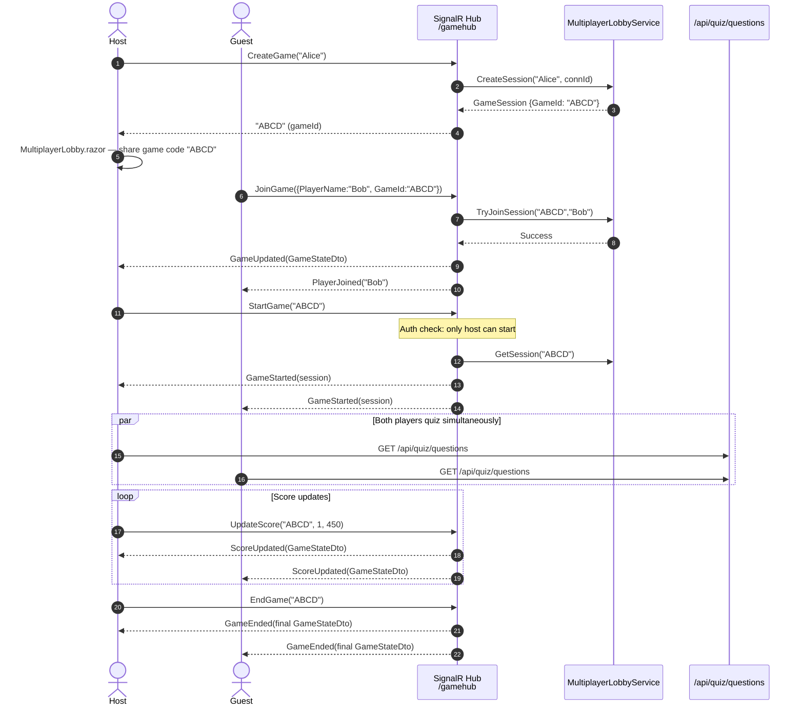
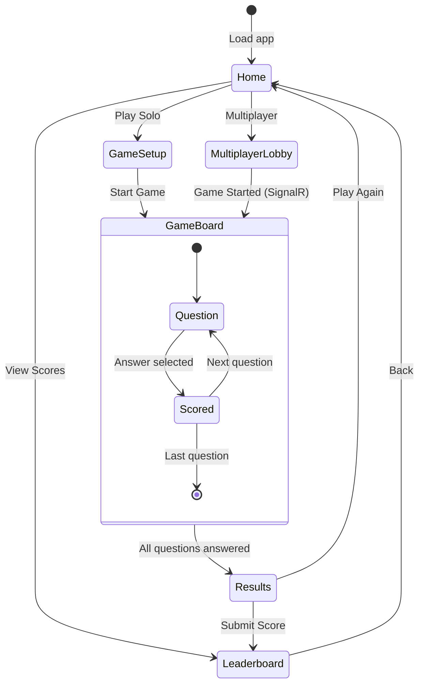
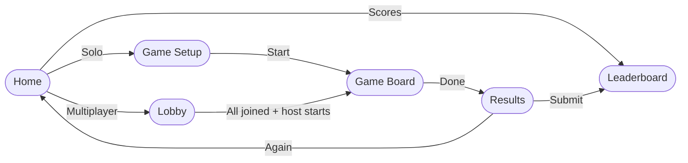

# ApplicationFlow — Auth Flow + User Journey

> **Full version** — Security flows and complete user journeys through all app screens.

## Authentication & Security Flow

```mermaid
sequenceDiagram
    autonumber
    actor Player
    participant Browser
    participant BlazorServer as PoFunQuiz.Web<br/>(Blazor Server)
    participant KeyVault as Azure Key Vault<br/>(PoShared)
    participant ManagedIdentity as Managed Identity
    participant OpenAI as Azure OpenAI
    participant TableStorage as Table Storage

    Note over BlazorServer: Application Startup
    BlazorServer->>ManagedIdentity: Request access token (DefaultAzureCredential)
    ManagedIdentity-->>BlazorServer: Token granted
    BlazorServer->>KeyVault: Fetch secrets (OpenAI key, SignalR conn str, AppInsights)
    KeyVault-->>BlazorServer: Secrets injected into IConfiguration

    Note over Player,Browser: Player arrives (no login required — anonymous play)
    Player->>Browser: Navigate to https://app-pofunquiz.azurewebsites.net
    Browser->>BlazorServer: GET / (HTTPS)
    BlazorServer-->>Browser: Blazor Server HTML + SignalR handshake
    Browser->>BlazorServer: WebSocket established (/_blazor)

    Note over Player,BlazorServer: CSP header enforced on every response
    BlazorServer-->>Browser: Content-Security-Policy: default-src 'self'; connect-src 'self' wss:
```

## Solo Quiz User Journey



## Multiplayer User Journey



## Page Navigation Map



---

## Simplified Flow


