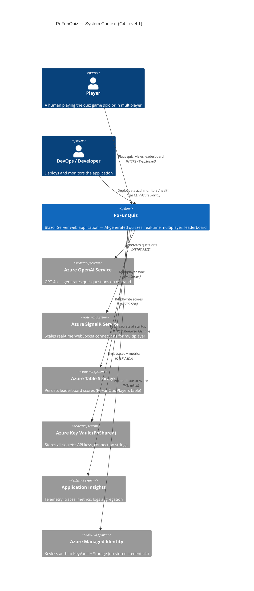
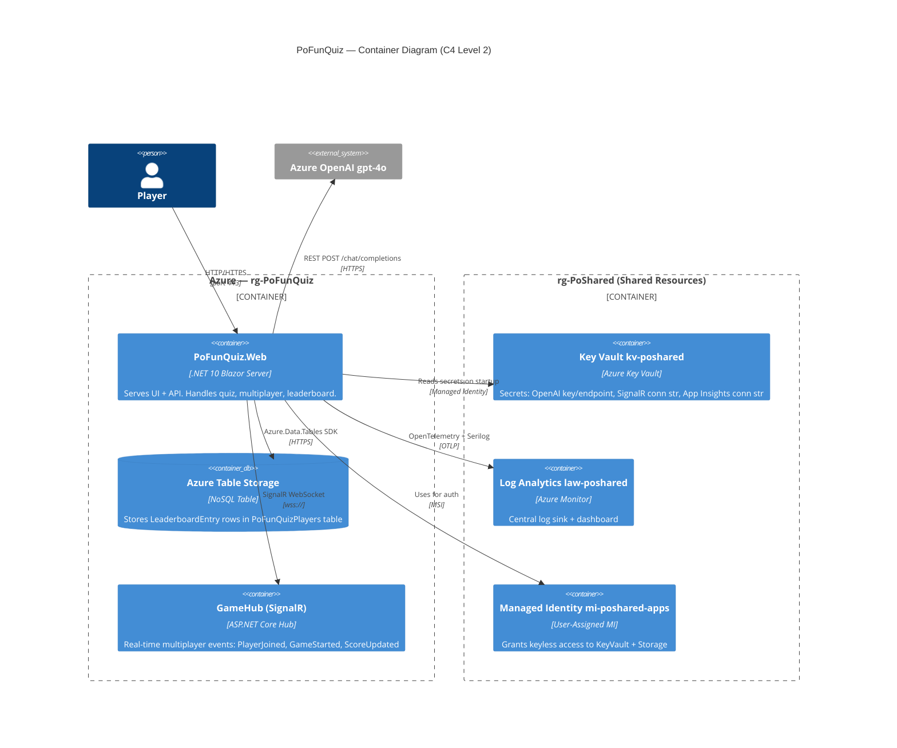
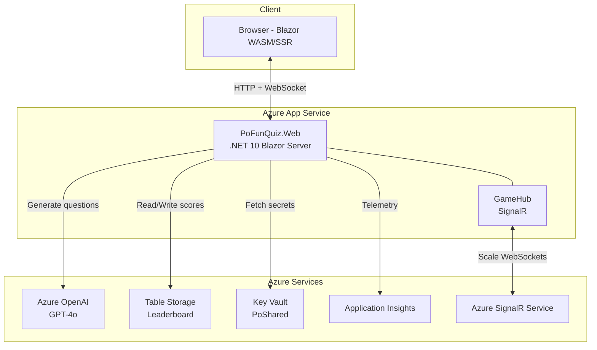

# Architecture — System Context + Container Diagram (C4)

> **Full version** (C4 Level 1 + Level 2 combined)  
> Render with any Mermaid-compatible viewer (GitHub, VS Code Mermaid extension, etc.)

## Full Diagram

## Container Diagram (C4 Level 2)

---

## Simplified Diagram

