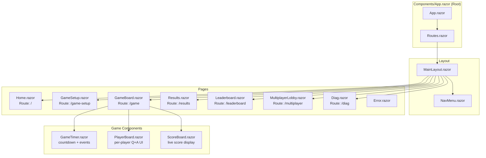
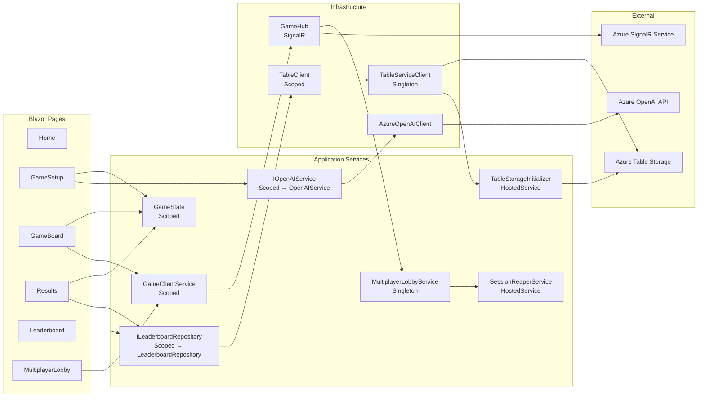
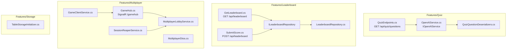
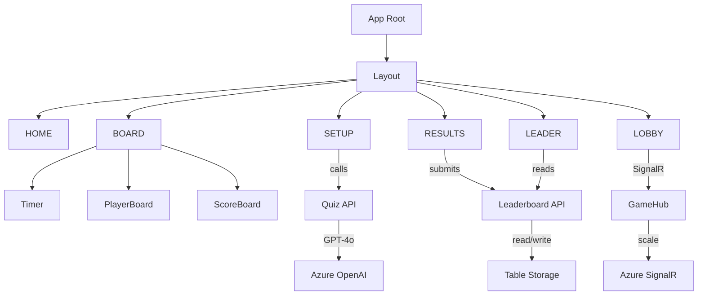

# ComponentMap — Component Tree + Service Dependencies

> **Full version** — Blazor component hierarchy and all service wiring.

## Blazor Component Tree

## Service Dependency Map

## Vertical Slice Feature Map

---

## Simplified Component Map

