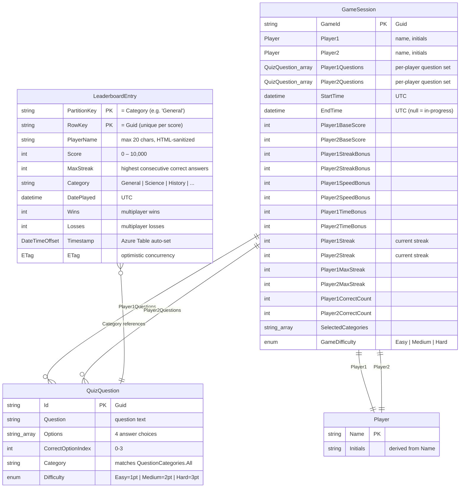
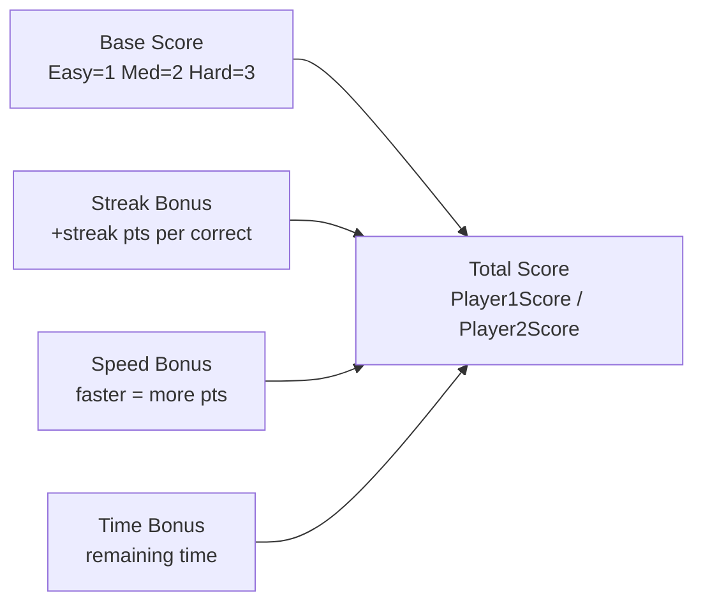
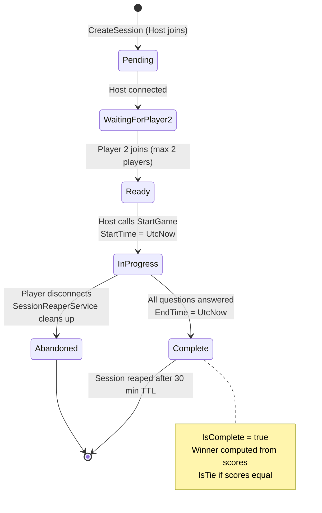
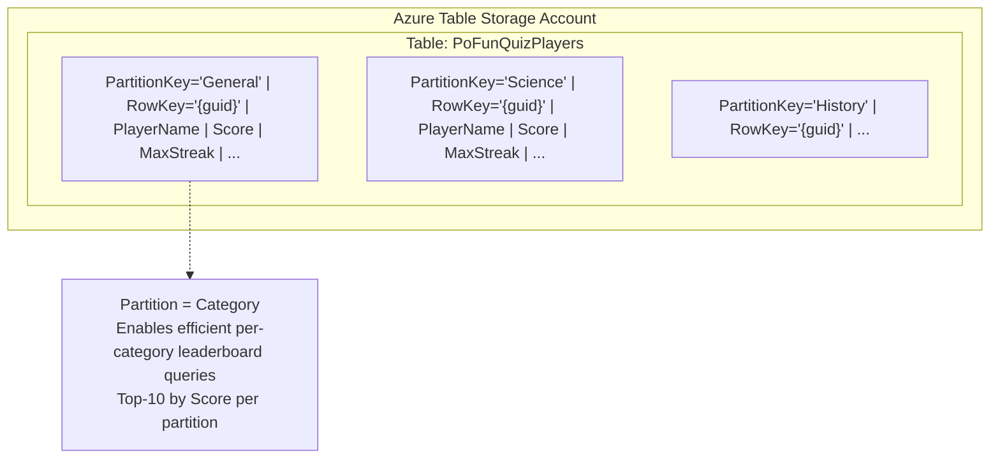
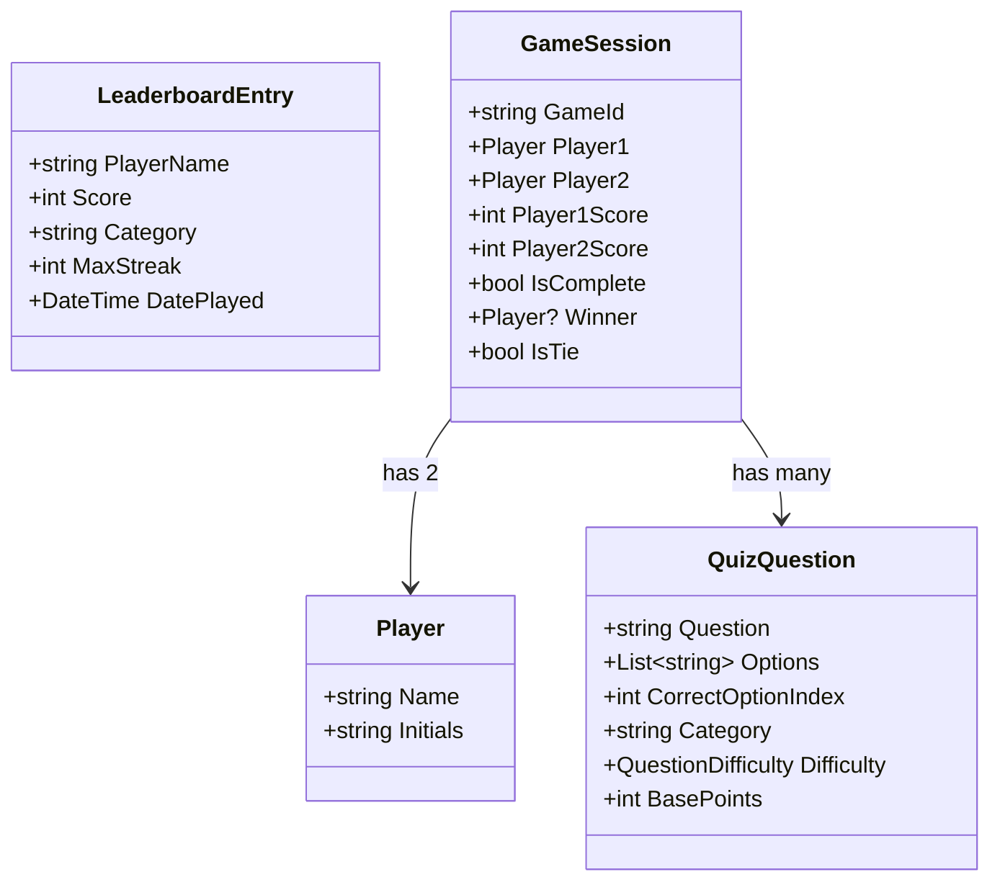

# DataModel — Database Schema + State Transitions

> **Full version** — Entity Relationship Diagram, in-memory models, and lifecycle state machines.

## Entity Relationship Diagram

## Scoring Formula

## GameSession State Machine

## Azure Table Storage Schema

---

## Simplified Data Model

