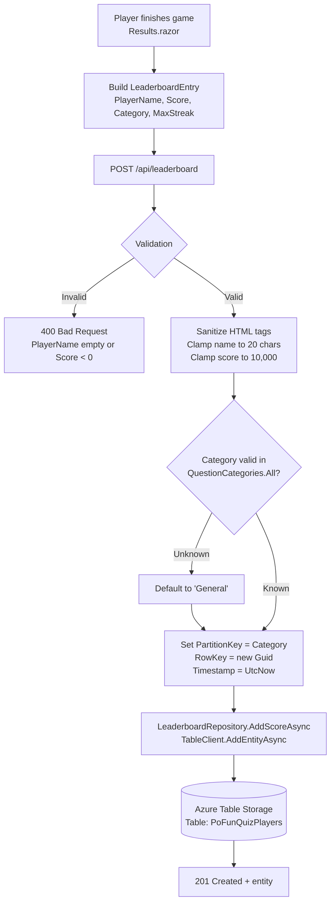
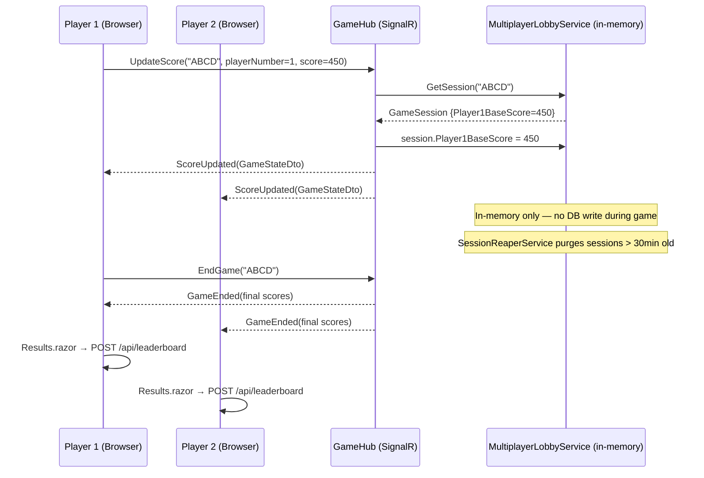
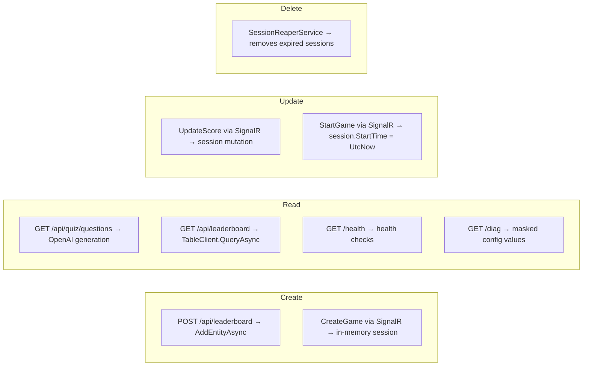
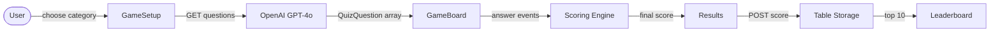

# DataPipeline — Data Workflow + User Workflow

> **Full version** — CRUD flows, question generation pipeline, and leaderboard persistence.

## Question Generation Pipeline

```mermaid
flowchart TD
    REQ[Client requests questions<br/>GET /api/quiz/questions?count=10&category=Science]
    CACHE{Output Cache<br/>60s TTL<br/>keyed on count+category}
    HIT[Return cached response]
    MISS[Cache miss]
    OTEL[Start OpenTelemetry Activity<br/>'QuizGeneration']
    PROMPT[Build GPT-4o system prompt<br/>category + count + difficulty + format]
    CALL[POST Azure OpenAI<br/>/chat/completions]
    PARSE[Deserialize JSON<br/>QuizQuestionDeserializers]
    VALIDATE{Valid questions?}
    RETRY[Retry / fallback]
    RETURN[Return QuizQuestion[]]
    LOG[Log: count + duration_ms<br/>activity tags set]

    REQ --> CACHE
    CACHE -->|Hit| HIT
    CACHE -->|Miss| MISS
    MISS --> OTEL --> PROMPT --> CALL --> PARSE --> VALIDATE
    VALIDATE -->|Yes| RETURN
    VALIDATE -->|No| RETRY --> CALL
    RETURN --> LOG
    RETURN --> CACHE
```

## Score Submission Pipeline



## Leaderboard Read Pipeline

```mermaid
flowchart TD
    REQ2[GET /api/leaderboard?category=Science]
    QUERY[LeaderboardRepository.GetTopScoresAsync<br/>TableClient.QueryAsync<br/>filter: PartitionKey eq 'Science']
    TABLE2[(Azure Table Storage<br/>PoFunQuizPlayers)]
    SORT[Sort by Score DESC]
    LIMIT[Take top 10]
    RETURN2[Return LeaderboardEntry[]]
    RENDER[Leaderboard.razor renders table]

    REQ2 --> QUERY --> TABLE2
    TABLE2 --> SORT --> LIMIT --> RETURN2 --> RENDER
```

## Multiplayer Score Sync Pipeline



## Full CRUD Matrix



---

## Simplified Data Pipeline


